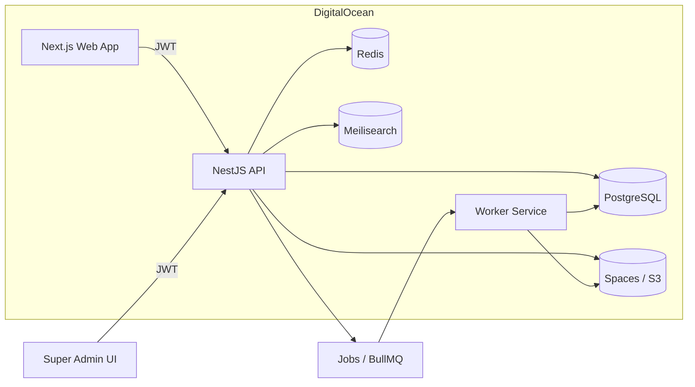

# PG MONITOR Architecture

## Goals
- Multi-tenant SaaS with strict tenant isolation
- White-label by default with instance-level branding
- Modular system where programs can enable modules without code
- Impact-first data model and KPIs baked into core flows
- API-first, cloud-native, cost-aware (DigitalOcean)

## High-Level Diagram

## Services
- Web App (Next.js)
  - Control plane UI
  - Instance branding and module configuration
  - Onboarding flows
- API (NestJS)
  - Multi-tenant data access
  - RBAC enforcement
  - Program and module management
  - KPI and reporting endpoints
- Worker (Node + BullMQ)
  - KPI rollups and scheduled metrics
  - Report generation (CSV/PDF)
  - Email and notification jobs

## Data Stores
- PostgreSQL
  - Core relational data model
  - Row Level Security (RLS) per tenant
  - Materialized views for KPIs and dashboards
- Redis
  - Job queues
  - Session and rate limiting caches
- Meilisearch
  - Fast search for profiles, events, and opportunities
- Spaces (S3)
  - File uploads
  - Reports and exports

## Multi-Tenancy
- Every record contains `tenant_id` (Instance ID)
- RLS policies enforce tenant boundaries in PostgreSQL
- API enforces tenant and role checks before data access

## Module Architecture
- Program defines active modules
- Module activation stored as data
- UI and API derive available features from module config
- No custom code required to enable/disable modules

Modules (MVP)
- Experience Builder
- Projects and Tasks
- Events
- Budgeting
- Audience and Network
- Connections
- Pipeline
- Surveys
- KPIs and Impact Dashboard

## Deployment on DigitalOcean (Minimal Budget)
Recommended minimal production setup
- App Platform or a single Droplet with Docker Compose
- Managed Postgres (basic tier)
- Spaces for files
- Optional: Managed Redis if budget allows

Cost-saving options (lower reliability)
- Self-host Postgres on the Droplet
- Single-node Redis on the Droplet

## Security and Compliance
- RBAC per Instance
- Audit log for key actions
- API key management
- SSO via OIDC (Google, Microsoft)
- Rate limiting at API

## Environments
- Local: Docker Compose
- Staging: DO App Platform or a Droplet
- Production: Same as staging with larger sizing
