# PG MONITOR ERD (MVP)

This ERD focuses on the core entities required for the MVP modules. All tables include:
- `id` (uuid)
- `tenant_id` (uuid, Instance)
- `created_at` (timestamp)
- `updated_at` (timestamp)

## Mermaid ER Diagram

```mermaid
erDiagram
  ORGANIZATIONS ||--o{ INSTANCES : owns
  INSTANCES ||--o{ INSTANCE_BRANDING : has
  INSTANCES ||--o{ USERS : contains
  USERS ||--o{ MEMBERSHIPS : has
  INSTANCES ||--o{ MEMBERSHIPS : defines
  ROLES ||--o{ MEMBERSHIPS : assigns

  INSTANCES ||--o{ PROGRAMS : contains
  PROGRAMS ||--o{ PROGRAM_PHASES : has
  PROGRAMS ||--o{ PROGRAM_MODULES : enables

  PROGRAMS ||--o{ SEGMENTS : defines
  SEGMENTS ||--o{ SEGMENT_RULES : has

  PROGRAMS ||--o{ PROJECTS : contains
  PROJECTS ||--o{ MILESTONES : has
  PROJECTS ||--o{ TASKS : contains
  TASKS ||--o{ TASK_ASSIGNMENTS : assigns
  TASKS ||--o{ TASK_DEPENDENCIES : depends
  TASKS ||--o{ FILES : attaches

  PROGRAMS ||--o{ EVENTS : hosts
  EVENTS ||--o{ EVENT_SESSIONS : has
  EVENTS ||--o{ EVENT_REGISTRATIONS : registers
  EVENT_SESSIONS ||--o{ EVENT_ATTENDANCE : tracks
  EVENTS ||--o{ EVENT_FEEDBACK : collects

  PROGRAMS ||--o{ BUDGETS : budgets
  BUDGETS ||--o{ BUDGET_ITEMS : contains
  COST_CATEGORIES ||--o{ BUDGET_ITEMS : categorizes
  FUNDING_SOURCES ||--o{ BUDGET_ITEMS : funds

  INSTANCES ||--o{ PROFILES : contains
  PROFILES ||--o{ RELATIONSHIPS : relates
  PROFILES ||--o{ INTERACTIONS : logs
  TAGS ||--o{ TAGGINGS : tags
  PROFILES ||--o{ TAGGINGS : tagged

  PROGRAMS ||--o{ MATCHES : matches
  MATCHES }o--|| PROFILES : source
  MATCHES }o--|| PROFILES : target

  PROGRAMS ||--o{ PIPELINES : has
  PIPELINES ||--o{ PIPELINE_STAGES : defines
  PIPELINES ||--o{ OPPORTUNITIES : tracks
  OPPORTUNITIES ||--o{ OPPORTUNITY_HISTORY : logs

  PROGRAMS ||--o{ SURVEYS : owns
  SURVEYS ||--o{ SURVEY_QUESTIONS : asks
  SURVEYS ||--o{ SURVEY_RESPONSES : collects
  SURVEY_RESPONSES ||--o{ SURVEY_ANSWERS : includes

  INSTANCES ||--o{ KPIS : defines
  KPIS ||--o{ METRICS : maps
  METRICS ||--o{ METRIC_VALUES : records

  INSTANCES ||--o{ API_KEYS : authenticates
  INSTANCES ||--o{ AUDIT_LOGS : audits
```

## Core Tables (MVP)

### Organizations and Instances
- organizations: top-level customer account
- instances: tenant boundaries and white-label configuration
- instance_branding: logo, color palette, domain, custom styling

### Users and Access
- users: authenticated users
- roles: instance-level roles
- memberships: user to instance role mapping

### Programs and Segments
- programs: time-bound or ongoing initiatives
- program_phases: optional phases with start and end
- program_modules: enable or disable modules
- segments: cohort definitions
- segment_rules: rule expressions for segments

### Projects and Tasks
- projects
- milestones
- tasks
- task_dependencies
- task_assignments
- files (attachments)

### Events
- events
- event_sessions
- event_registrations
- event_attendance
- event_feedback

### Budgeting
- budgets
- budget_items
- cost_categories
- funding_sources

### Audience and Network
- profiles: participants, mentors, partners, volunteers
- relationships: mentor, peer, partner
- interactions: notes, meetings, calls
- tags and taggings

### Connection Engine
- matches: rule-based matches between profiles

### Pipeline
- pipelines
- pipeline_stages
- opportunities
- opportunity_history

### Surveys
- surveys
- survey_questions
- survey_responses
- survey_answers

### KPIs and Metrics
- kpis
- metrics
- metric_values (polymorphic reference to entities or activities)

### Platform
- api_keys (integrations)
- audit_logs

## Notes
- `profiles` can represent non-authenticated community members, partners, or investors.
- `metric_values` stores `subject_type` and `subject_id` to tie metrics to any entity or activity.
- RLS policies enforce that `tenant_id` matches the authenticated instance.

